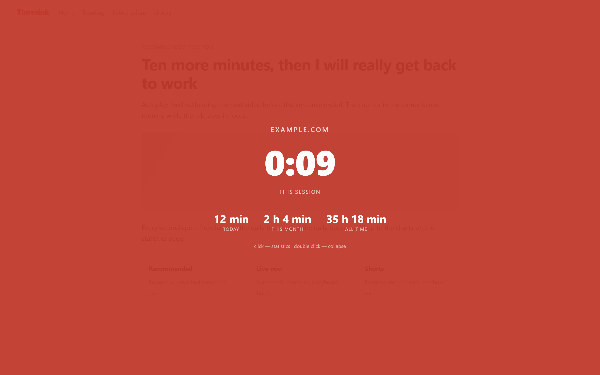
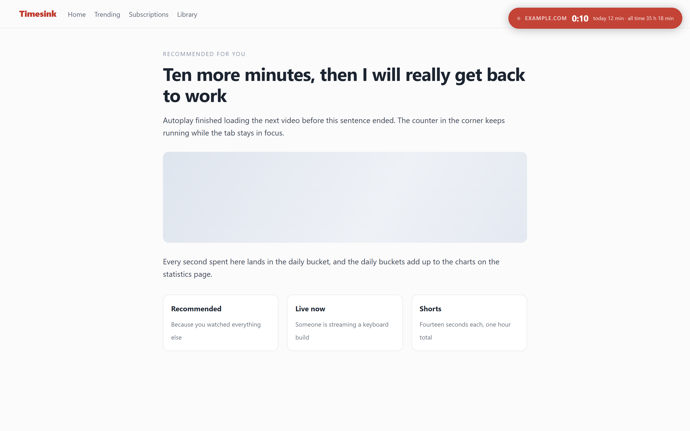
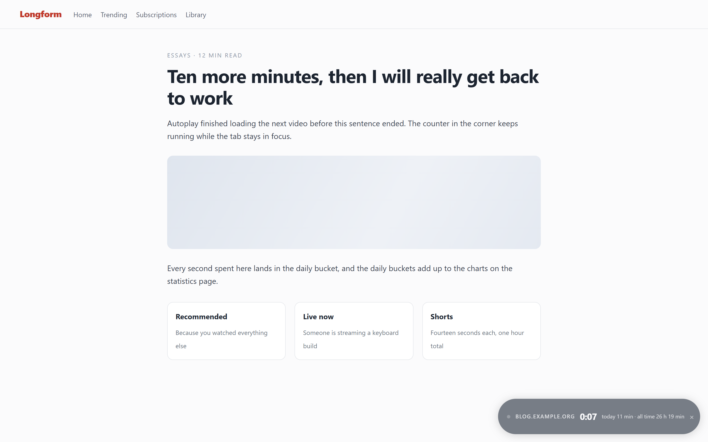
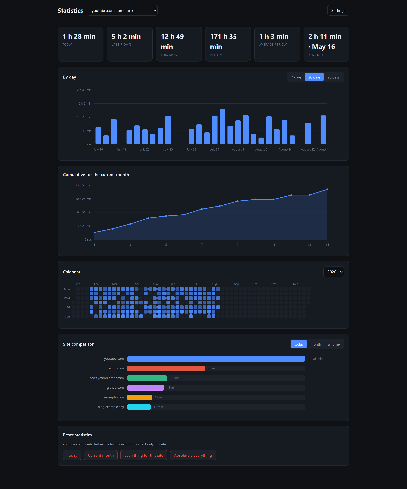
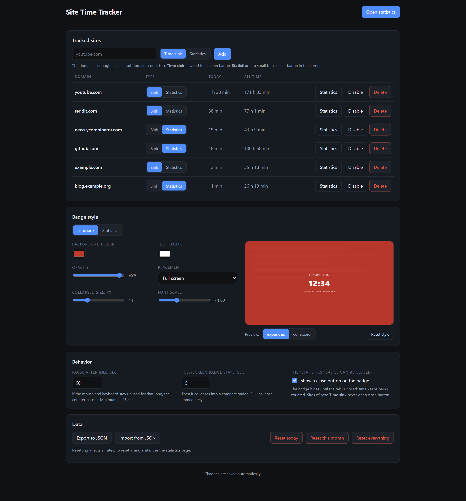
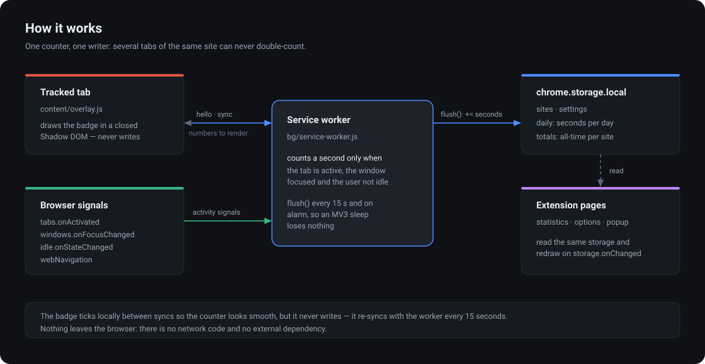

# Site Time Tracker

> **Generated with [Claude Code](https://claude.com/claude-code).** Every line in this
> repository — the extension, the documentation and all four translations — was written by
> Claude Code (Anthropic) from plain-language requests. Nothing here was hand-written.

A Chrome extension (Manifest V3) that counts the time you spend on the sites you pick, shows a
live counter on top of the page and keeps detailed statistics. No build step, no dependencies,
no network calls — everything stays in your browser.



## Screenshots

A "time sink" site gets the red full-screen badge above; after a few seconds it collapses into a
pill that keeps ticking. A "statistics" site gets a small translucent badge in the corner, with an
optional close button.

| Collapsed time-sink badge | Statistics badge |
|---|---|
|  |  |

The statistics page: totals, a bar chart by day, a cumulative curve for the current month, a
year-long calendar heatmap and a site-by-site comparison — all rendered by a hand-written SVG
renderer, because Manifest V3's CSP rules out charting libraries.



Settings: the site list, both badge presets with a live preview, behavior and data management.



## How it works



Time is counted **only** by the service worker. The badge and the popup ask it for ready-made
numbers and never write to storage themselves — that is what keeps several tabs of the same site
from double-counting.

## Install

1. Open `chrome://extensions` and turn on **Developer mode**.
2. Choose **Load unpacked** and point it at this folder.
3. Open the extension settings and add your first site.

There is nothing to build: plain JavaScript and ES modules.

## Two site types

| Type | When to pick it | Default badge |
|---|---|---|
| **Time sink** | the site steals your time and you want to feel it | red, full screen, collapses into a pill after 5 seconds |
| **Statistics** | you are just curious where the hours go | small translucent badge in the bottom-right corner |

Click the badge to open the statistics page, double-click to collapse or expand it. The statistics
badge can also carry a close button that hides it until the tab is closed — time keeps being
counted either way.

## What counts as time

- The counter runs while the tab is active, the browser window is focused and you are not idle
  (60 seconds by default, configurable).
- A **session** belongs to a tab: switching to another tab pauses it, leaving the domain or
  closing the tab resets it.
- Sites are matched by domain, subdomains included — `youtube.com` also covers `m.youtube.com`.
  When both `example.com` and `sub.example.com` are listed, the more specific one wins.

## Settings

- the site list: type, enable/disable, delete (with or without its statistics);
- both badge presets with a live preview — colors, opacity, placement (full screen / edge bar /
  corner badge), size and font scale;
- behavior: idle timeout, how long the full-screen badge stays, whether the statistics badge is
  closable;
- data: export and import everything as JSON, reset today / this month / everything.

## Languages

The interface ships in **English, Russian, German and French**. Chrome picks the language from its
own interface language and falls back to English; dates and month names follow the same locale.
Translations live in `_locales/<lang>/messages.json`.

## Project layout

```
manifest.json
_locales/      en · ru · de · fr        — interface translations
src/
  common/      storage.js · match.js · time.js · defaults.js · i18n.js · ui.css
  bg/          service-worker.js        — counts time, the single source of truth
  content/     overlay.js               — the badge, in a closed Shadow DOM
  stats/       stats.html/.js · charts.js — statistics and dependency-free SVG charts
  options/     options.html/.js         — settings
  popup/       popup.html/.js           — quick look at the current site
docs/          documentation and images
```

## Documentation

The detailed docs are written in Russian:

- [docs/usage.md](docs/usage.md) — installation and day-to-day use
- [docs/architecture.md](docs/architecture.md) — how the tracker is wired, messaging, MV3 lifecycle
- [docs/data-model.md](docs/data-model.md) — storage schema, aggregation, resets, export/import
- [docs/development.md](docs/development.md) — extending, debugging, manual and automated checks

A short summary for coding agents lives in [CLAUDE.md](CLAUDE.md).
